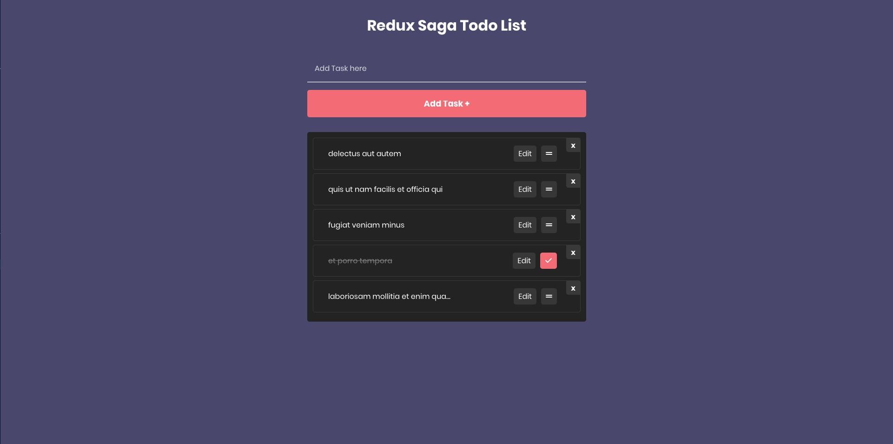
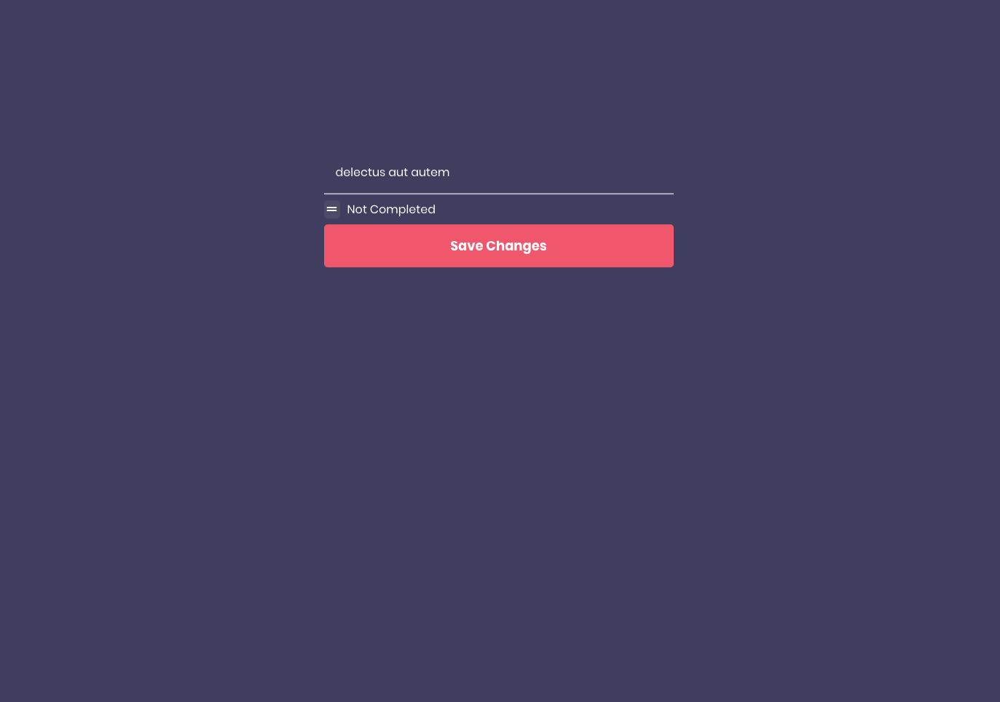

<h1 style="text-align: center">
  
  <span style="margin-left: 16px">Redux Saga Todo List</span>
</h1>


<div style="text-align: center">
    
     
</div>

---

## :page_with_curl: About

This project was created to study more about Redux and learn Redux Saga to improve the state management of an application.

👉 [CLICK HERE](https://todo-list-ebaeaf.netlify.app/) to see it running in your browser.

## :rocket: Technologies

- [React](https://reactjs.org/)
- [Redux](https://redux.js.org/)
- [Redux-Saga](https://redux-saga.js.org/)
- [Styled Components](https://www.styled-components.com/)
- [Axios](https://github.com/axios/axios)

## :information_source: How To Use

To clone and run this application, you'll need [Git](https://git-scm.com), [Node.js][nodejs] + [Yarn][yarn] installed on your computer.

From your command line:

```bash
# Clone this repository
$ git clone https://github.com/jeff-ofobrukweta/todo-list.git

# Go into the repository
$ cd todo-list

# Install dependencies
$ yarn install

# Run the app
$ yarn start
```

## :man: Author

Made with ♥ by Ofobrukweta Jeff | [Follow me on Linkedin](https://www.linkedin.com/in/ofobrukweta-jeff-207506136/)

[nodejs]: https://nodejs.org/
[yarn]: https://yarnpkg.com/
[vc]: https://code.visualstudio.com/
